# Hungry Delete Extension for Visual Studio Code

I find it very annoying to press backspace multiple times to remove the leading tabs or whitespaces in order to return to the previous end of the line.

Therefore, I created this extension, it overrides `ctrl+backspace` key binding, once `ctrl+backspace` is pressed, a command is executed.

Later I found that sometimes I just want to delete the upper line and keep the indent (Personally I don't use backspace to adjust the indent, I use `ctrl+[`), so I added the smart backspace feature which overrides `backspace`.

## Features

### Hungry Delete

To delete **ALL** tab or whitespaces before the cursor, until it reaches a non-empty character.

- Windows and Linux : Press `ctrl+backspace`
- Mac : Press `alt+backspace`

What you need to do before **Hungry Delete** :

Press `ctrl+backspace` multiple times to delete the leading spaces and tabs

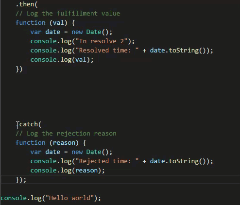

What you need to do after **Hungry Delete** :

Press `ctrl+backspace` **ONCE** to delete the leading spaces and tabs until you reach a non-empty character

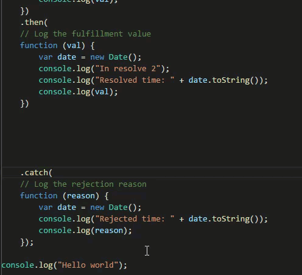

**Hungry Delete** also supports multiple cursors

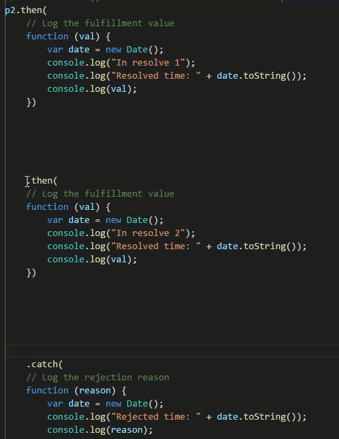

### Smart Backspace

To delete the upper empty line or delete all tabs or whitespaces until the end of the previous line.

- Windows and Linux and Mac: Press `backspace`

What you need to do before **Smart Backspace** :

Press `backspace` multiple times to delete the leading tabs or space to upper line. (Or press the upper arrow and press `ctrl+k`)

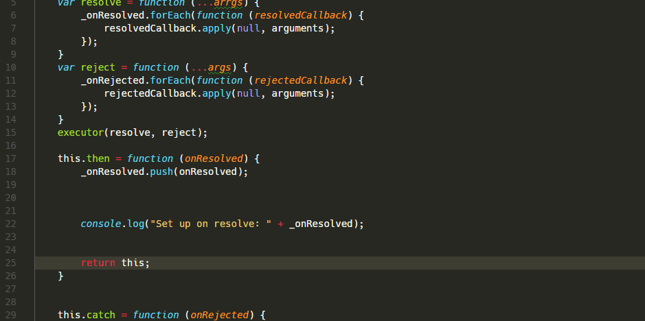

What you need to do after **Smart Backspace** :

Press `backspace` once

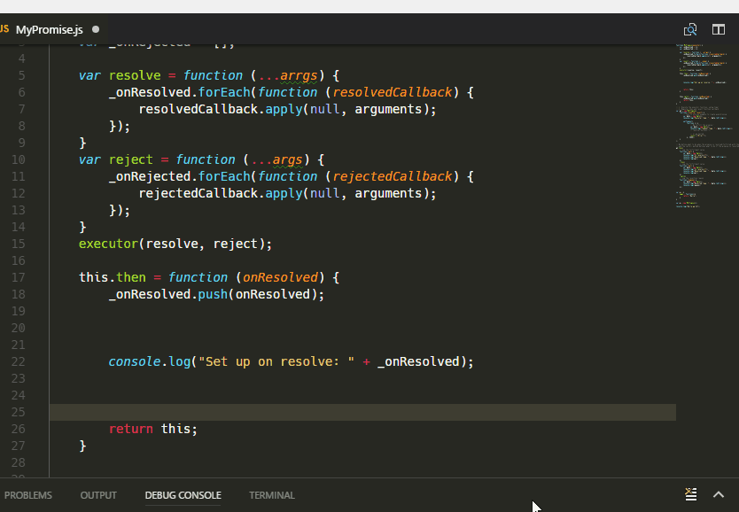

Smartbackspace also support **multiple cursor**

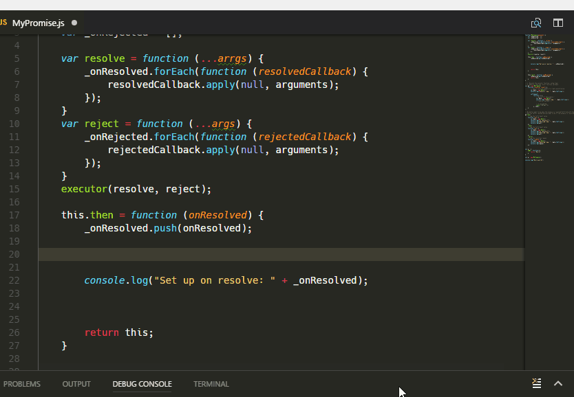

#### Keep One Space

Set to `true` to keep at least one space after the last word of the previous line with smart backspace. By default, this is `false`.

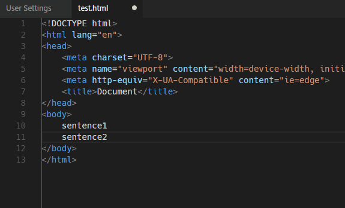

```json
{
    "hungryDelete.keepOneSpace" : true
}
```

#### Consider Increase Pattern

Set to `true` to consider increase pattern. By default, this is `false`.

It tries to "guess" the indentation of cursor line, and compute the expected indentation of cursor line.
If the indentation is not right, it just deletes whitespace to fit the indentation level, but not deleting the line break.

In the gif below:

`ul` match the increase pattern rule so `li` have one more indent level.
However, `li` is too deep, smart backspace just deletes the whitespace before `li` to fit the indentation level it expected.

For detail, please see.


```json
{
    "hungryDelete.considerIncreaseIndentPattern": true
}
```

This feature only supports [a few languages](#language-configuration)

#### Follow Above Line Indent

Set to `true` to follow above line indent. By default, this is `false`.

1st `li` doesn't match the increase pattern rule, but 2nd `li` follow the indent of 1st `li`.

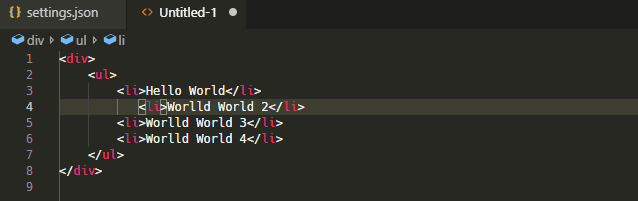


```json
{
    "hungryDelete.followAbovelineIndent": true
}
```

## Setting

### Change the key binding

By default, hungry delete command maps to `ctrl+backspace` on windows and Linux, `alt+backspace` on mac.
The following snippet can be placed inside `keybings.json` file to override the default key binding,
it sets `ctrl+shift+backspace` for the command.

```json
{
        "key": "ctrl+shift+backspace",
        "command": "extension.hungryDelete",
        "when": "editorTextFocus && !editorReadonly"
}
```

### Disable smart backspace

To disable smart backspace, just set `hungryDelete.enableSmartBackspace` to be false in the setting.

```json
{
    "hungryDelete.enableSmartBackspace" : false
}
```

### Language Configuration

In order to power [consider-increase-pattern](#consider-increase-pattern), it needs language configuration.
However, VSCode doesn't provide API to retrieve the language configuration, therefore I copied the following configuration from vscode source code, and embedded it in the extension. If you need to support another language, you need to adjust the following setting.

```json
"hungryDelete.languageConfigurations" : {
    "type": "array",
    "description": "Provide language configuration which affects the behaviour of smart backspace",
    "default": [
        {
            "languageId": "html",
            "indentationRules": {
                "increaseIndentPattern": "<(?!\\?|(?:area|base|br|col|frame|hr|html|img|input|link|meta|param)\\b|[^>]*\\/>)([-_\\.A-Za-z0-9]+)(?=\\s|>)\\b[^>]*>(?!.*<\\/\\1>)|<!--(?!.*-->)|\\{[^}\"']*$",
                "decreaseIndentPattern": "^\\s*(<\\/(?!html)[-_\\.A-Za-z0-9]+\\b[^>]*>|-->|\\})"
            }
        },
        {
            "languageId": "go",
            "indentationRules": {
                "increaseIndentPattern": "^.*(\\bcase\\b.*:|\\bdefault\\b:|(\\b(func|if|else|switch|select|for|struct)\\b.*)?{[^}\"'`]*|\\([^)\"'`]*)$",
                "decreaseIndentPattern": "^\\s*(\\bcase\\b.*:|\\bdefault\\b:|}[)}]*[),]?|\\)[,]?)$"
            }
        },
        {
            "languageId": "json",
            "indentationRules": {
                "increaseIndentPattern": "^.*(\\{[^}]*|\\[[^\\]]*)$",
                "decreaseIndentPattern": "^\\s*[}\\]],?\\s*$"
            }
        },
        {
            "languageId": "less",
            "indentationRules": {
                "increaseIndentPattern": "(^.*\\{[^}]*$)",
                "decreaseIndentPattern": "^\\s*\\}"
            }
        },
        {
            "languageId": "lua",
            "indentationRules": {
                "increaseIndentPattern": "^((?!(\\-\\-)).)*((\\b(else|function|then|do|repeat)\\b((?!\\b(end|until)\\b).)*)|(\\{\\s*))$",
                "decreaseIndentPattern": "^\\s*((\\b(elseif|else|end|until)\\b)|(\\})|(\\)))"
            }
        },
        {
            "languageId": "php",
            "indentationRules": {
                "increaseIndentPattern": "({(?!.+}).*|\\(|\\[|((else(\\s)?)?if|else|for(each)?|while|switch).*:)\\s*(/[/*].*)?$",
                "decreaseIndentPattern": "^(.*\\*\\/)?\\s*((\\})|(\\)+[;,])|(\\][;,])|\\b(else:)|\\b((end(if|for(each)?|while|switch));))"
            }
        },
        {
            "languageId": "ruby",
            "indentationRules": {
                "increaseIndentPattern": "^\\s*((begin|class|(private|protected)\\s+def|def|else|elsif|ensure|for|if|module|rescue|unless|until|when|while|case)|([^#]*\\sdo\\b)|([^#]*=\\s*(case|if|unless)))\\b([^#\\{;]|(\"|'|\/).*\\4)*(#.*)?$",
                "decreaseIndentPattern": "^\\s*([}\\]]([,)]?\\s*(#|$)|\\.[a-zA-Z_]\\w*\\b)|(end|rescue|ensure|else|elsif|when)\\b)"
            }
        },
        {
            "languageId": "typescript",
            "indentationRules": {
                "increaseIndentPattern": "^((?!.*?\\/\\*).*\\*\\/)?\\s*[\\}\\]].*$",
                "decreaseIndentPattern": "^((?!\\/\\/).)*(\\{[^}\"'`]*|\\([^)\"'`]*|\\[[^\\]\"'`]*)$"
            }
        },
        {
            "languageId": "yaml",
            "indentationRules": {
                "increaseIndentPattern": "^\\s*.*(:|-) ?(&amp;\\w+)?(\\{[^}\"']*|\\([^)\"']*)?$",
                "decreaseIndentPattern": "^\\s+\\}$"
            }
        }
    ]
}
```

## Conflict With Vim Extension

Because [Vim extension](https://marketplace.visualstudio.com/items?itemName=jasonlhy.hungry-delete) define its own `vim_backspace`. In order to work with [Vim extension](https://marketplace.visualstudio.com/items?itemName=jasonlhy.hungry-delete) in insert mode, normal mode and visual mode, add the following setting in `keybindings.json`

```json
    // Cancel the original vim backspace
    {
        "key": "backspace",
        "command": "-extension.vim_backspace",
        "when": "editorTextFocus && vim.active && !inDebugRepl"
    },
    // Enable the vim backspace only in search mode
    {
        "key": "backspace",
        "command": "extension.vim_backspace",
        "when": "editorTextFocus && vim.active && !inDebugRepl && vim.mode == 'SearchInProgressMode'"
    },
```

### Steps

1. Click "No" if VSCode detected that this extension has a conflict with Vim extension

    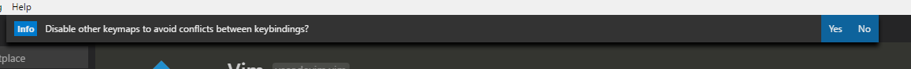

2. Add setting into `keybindings.json`

    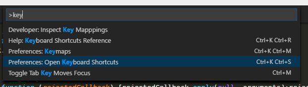

    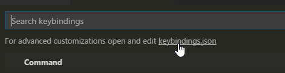

    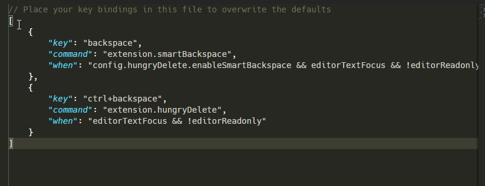

## Development

1. `git clone https://github.com/Jasonlhy/VSCode-Hungry-Delete.git`
2. `npm install`
3. Edit `src/extension.ts`

## Implementation

Please refer to implementation.md for detail.

## Reference

The term **Hungry Delete** comes from [Emacs](http://www.gnu.org/software/emacs/manual/html_node/emacs/Hungry-Delete.html)

The term **Smart Backspace** comes from [PhpStorm](https://blog.jetbrains.com/phpstorm/2014/09/smart-backspace-in-phpstorm-8/)
